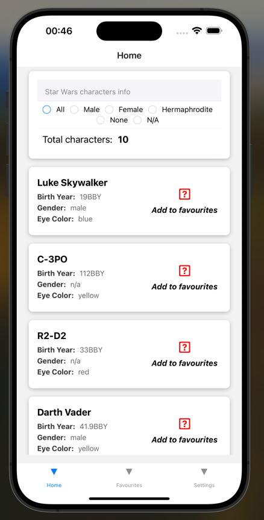
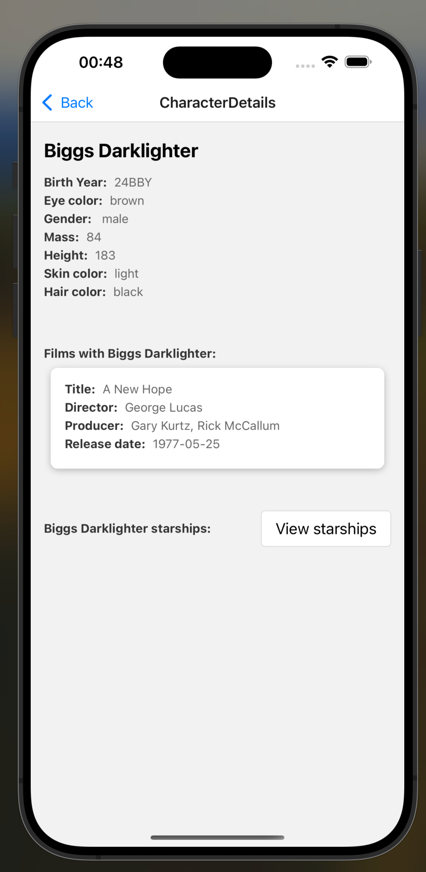
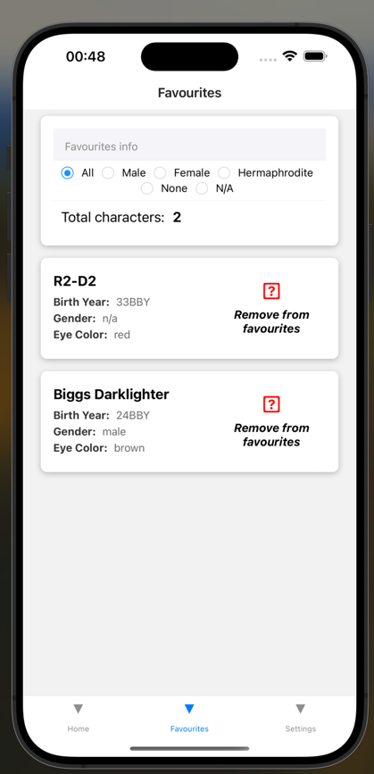
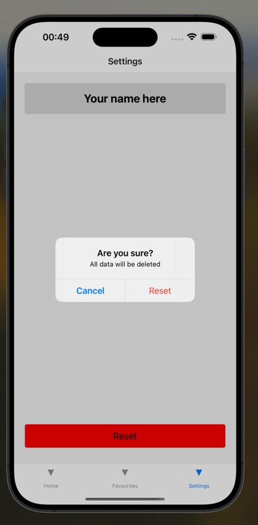

This is a new [**React Native**](https://reactnative.dev) project, bootstrapped using [`@react-native-community/cli`](https://github.com/react-native-community/cli).

# Description 
I created an app with three tabs and a screen to display character information. I used the context as a state manager because it was faster and easier in my opinion, considering that it is not a large application. I use AsyncStotage to simulate working with a database. Unfortunately, in the returned data from SWAPI, I did not find unique identifiers for characters, so I store all information about the character in AsyncStorage. On the Home tab, you can view available information about characters and add them to your favorite list, I also added the ability to sort characters by gender and the ability to see the total number of characters by gender. On the Favorites tab, you can view your favorite characters, sort them by gender, view the total number by gender, and delete them from the list. On a separate screen for each character, I added the ability to upload all available information about it and view it.
In the settings tab I added an option to enter my name and reset to default settings.


IMPORTANTLY!! I didn't have time to adjust the icons so they don't display correctly.
The name and all characters added to the list will be saved even after restarting the application





# Getting Started

## Node and NPM Installation

Our project requires Node.js (version > 18) and NPM. If you don't have Node.js installed, you can install it using the following steps:

1. Install Node.js and NPM following the official installation guide for your operating system.
2. Alternatively, you can use Node Version Manager (NVM) for Node.js installation.

## CocoaPods Installation

CocoaPods is required for iOS development. Follow these steps to install CocoaPods:

1. Open Terminal and run the command: `sudo gem install cocoapods`.
2. To verify the installation, run: `pod --version`.

## Android Emulator

1. For use Android Emulator you need to set up your IntelliJ IDEA or Android Studio


## iOS Setup

To set up the iOS project for development, follow these steps:

1. Open your terminal and navigate to the `ios` directory within the project:
2. Install CocoaPods dependencies by running the following command:
```bash
pod install
```

This will install all the required libraries and dependencies specified in the `Podfile`.

